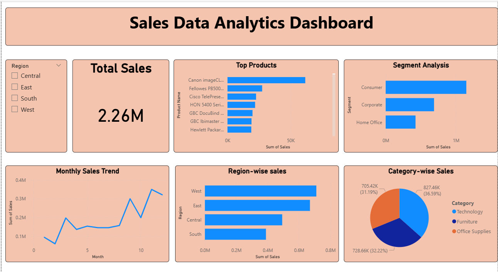

# 📊 Sales Data Analytics Dashboard

## 📌 Overview
This project focuses on analyzing sales data to extract meaningful insights and visualize key business metrics using Power BI.

## 🚀 Key Features
- Interactive dashboard with region-based filtering
- Monthly sales trend analysis
- Top-performing products identification
- Customer segment analysis
- Category-wise sales distribution

## 🛠️ Tech Stack
- Python (Pandas, NumPy)
- Power BI
- Data Cleaning & Analysis

## 📊 Dashboard Preview

## 📈 Key Insights
- West region generates highest sales
- Consumer segment contributes the most revenue
- Sales show an increasing trend towards the end of the year
- Technology category leads overall sales

## 📂 Project Structure
- `data/` → Cleaned dataset
- `dashboard/` → Power BI file
- `images/` → Dashboard screenshots

## ▶️ How to Use
1. Download the dataset from `data/`
2. Open `.pbix` file in Power BI Desktop
3. Interact with filters and visuals

## 📫 Contact
- Email: dhanashrimagdum88@gmail.com
- LinkedIn: www.linkedin.com/in/dhanashri-magdum-b72a6922b
